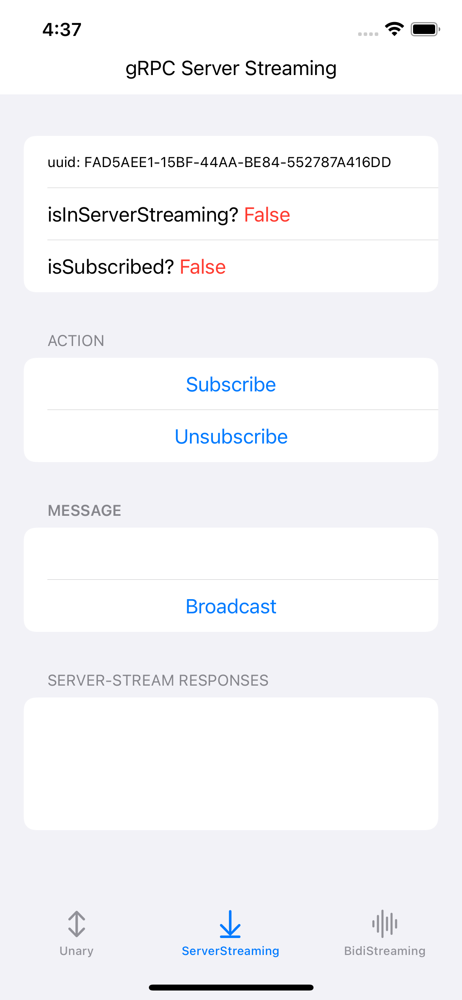

# gRPC MongoDB SwiftUI templete

The demo illustrates the Golang *gRPC* server with MongoDB database communicates with an iOS client.

```mermaid
classDiagram
	direction RL
	class iOS
	iOS : SwiftUI
	iOS : Combine
	
	class Server
	Server : Golang
	Server : MongoDB
	Server : (Docker)
	
Server  < .. > iOS  : gRPC 
```




## Logistics

#### Run the server

```shell
docker-compose up
```

#### And then run the *Storage* XCode Project.


## Notes
gRPC expose port is `localhost:50051`.

*mongo-express* is available at `localhost:8081`.


## License
[MIT](https://github.com/itsjohnye/grpc-helloworld-swiftui-client/blob/main/LICENSE)
